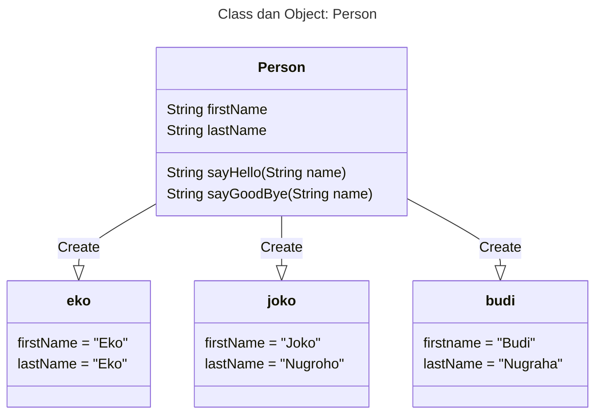
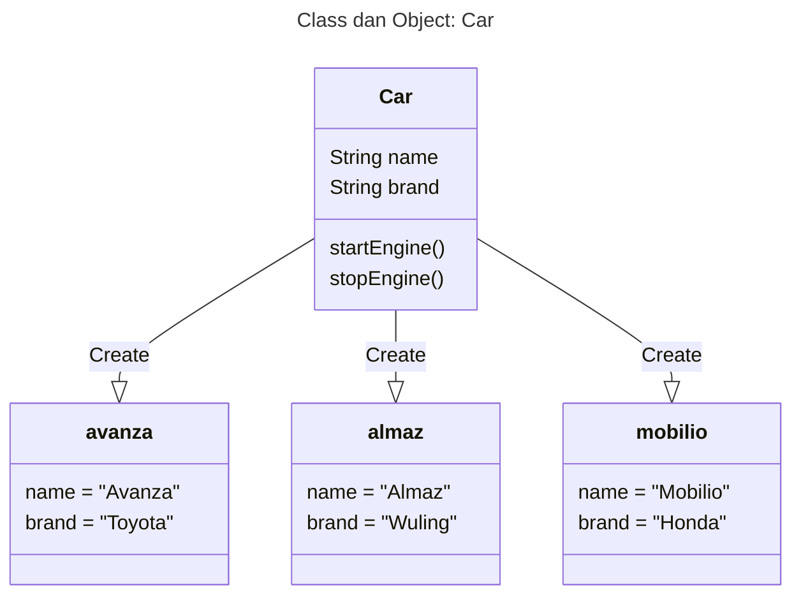

# Java Object Oriented Programming

## Catatan
- Harus mengerti dasar Java

## Daftar Isi
- Pengenalan OOP
- Object
- Class
- Method
- Pewarisan
- Interface
- Enum
- Exception
- Dan lain - lain

## Pengenalan Object Oriented Programming

### Apa itu Object Oriented Programming ?
- Object Oriented Programming adalah sudut pandang bahasa pemrograman yang berkonsep "object"
- Ada banyak sudut pandang bahasa pemrograman, namun OOP adalah yang sangat populer saat ini
- Ada beberapa istilah yang perlu dimengerti dalam OOP, yaitu: Object dan Class

#### Apa itu Object ?
- Object adalah data yang berisi field / property / attributes dan method / function / behavior
- Semua data bukan primitif di Java adalah object, dari mulai Integer, Boolean, Character, String, dan yang lainnya

#### Apa itu Class ?
- Class adalah blueprint, prototype atau cetakan untuk membuat Object
- Class berisikan informasi semua properties dan functions yang dimiliki oleh Object
- Setiap Object selalu dibuat dari Class
- Dan dari sebuah Class bisa membuat tanpa batas

## Class

### Membuat Class
- Untuk membuat class, kita menggunakan kata kunci class
- Penamaan class biasa menggunakan format CamelCase

## Object

### Membuat Object
- Object adalah hasil instansiasi dari sebuah class
- Untuk membuat object kita bisa menggunakan kata kunci new, dan diikuti dengan nama Class dan kurung()

## Field
- Fields / Properties / Attributes adalah data yang bisa kita sisipkan di dalam object
- Namun sebelum kita bisa memasukan data di fields, kita harus mendeklarasikan data apa aja yang dimiliki object tersebut di dalam deklarasi class-nya
- Membuat field sama seperti membuat variable, namun ditempatkan di block class

### Manipulasi Field
- Fields yang ada di object, bisa kita manipulasi. Tergantung final atau bukan.
- Jika final, berarti kita tidak bisa mengubah data field nya, namun jika tidak, kita bisa mengubah field nya
- Untuk memanipulasi data field, sama seperti cara pada variable
- Untuk mengakses field, kita butuh kata kunci (.) setelah nama object dan diikuti nama fields nya

## Method
- Selain menambahkan field, kita juga bisa menambahkan method ke object
- Caranya dengan mendeklarasikan method tersebut di dalam block class
- Sama seperti method biasanya, kita juga bisa menambahkan return value, parameter dan method overloading di method yang ada di dalam block class
- Untuk mengakses method tesebut, kita bisa menggunakan tanda titik (.) dan diikuti dengan nama method nya. Sama seperti mengakses field

