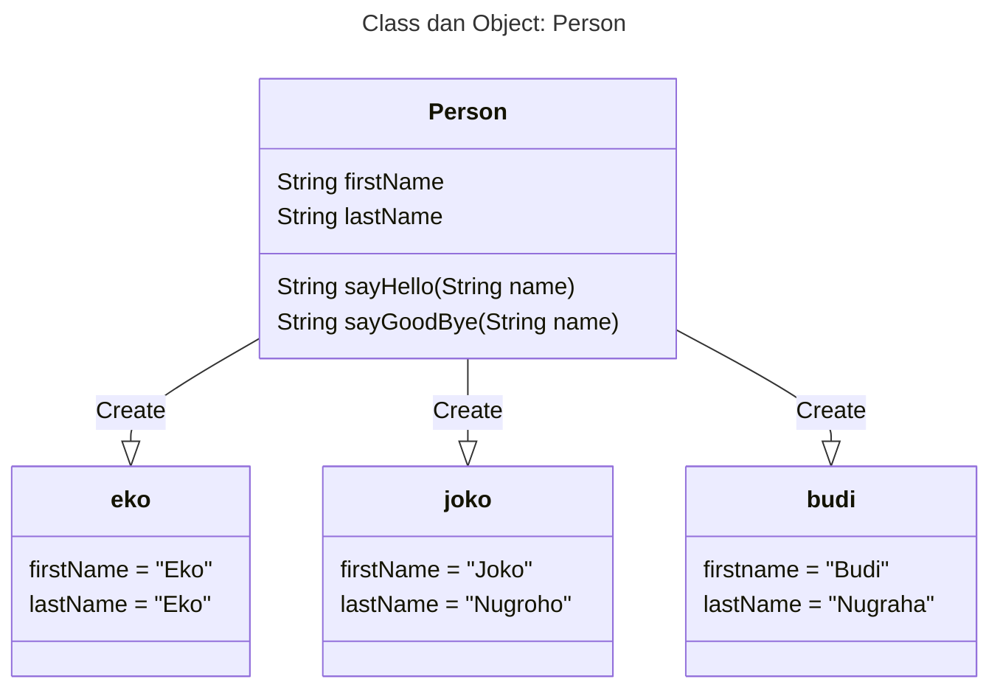
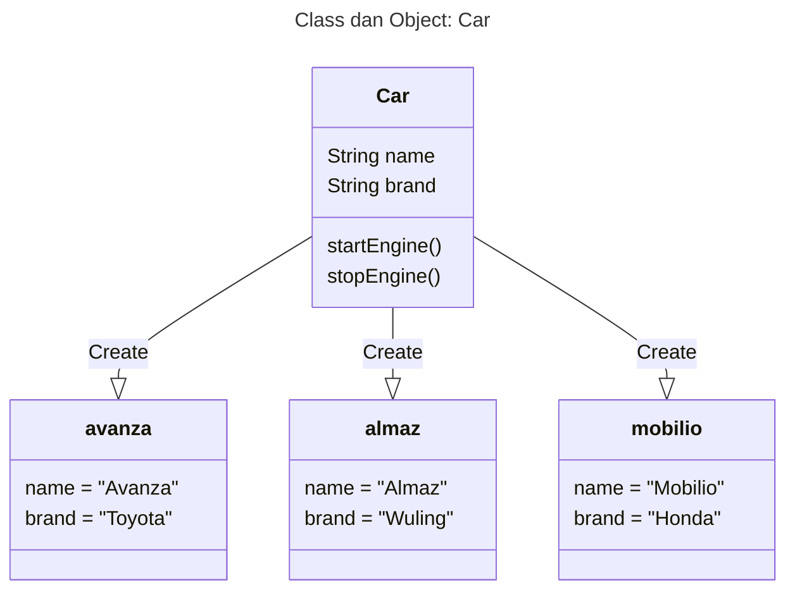

# Java Object Oriented Programming

## Catatan
- Harus mengerti dasar Java

## Daftar Isi
- Pengenalan OOP
- Object
- Class
- Method
- Pewarisan
- Interface
- Enum
- Exception
- Dan lain - lain

## Pengenalan Object Oriented Programming

### Apa itu Object Oriented Programming ?
- Object Oriented Programming adalah sudut pandang bahasa pemrograman yang berkonsep "object"
- Ada banyak sudut pandang bahasa pemrograman, namun OOP adalah yang sangat populer saat ini
- Ada beberapa istilah yang perlu dimengerti dalam OOP, yaitu: Object dan Class

#### Apa itu Object ?
- Object adalah data yang berisi field / property / attributes dan method / function / behavior
- Semua data bukan primitif di Java adalah object, dari mulai Integer, Boolean, Character, String, dan yang lainnya

#### Apa itu Class ?
- Class adalah blueprint, prototype atau cetakan untuk membuat Object
- Class berisikan informasi semua properties dan functions yang dimiliki oleh Object
- Setiap Object selalu dibuat dari Class
- Dan dari sebuah Class bisa membuat tanpa batas

